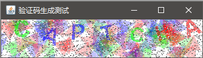

# 验证码生成工具

生成图片验证码的工具类。



## API

CaptchaFactory.java
```java
/**
 * 自动生成随机的验证码图片
 *
 * @param charNum   验证码字符数
 * @param charArray 可选字符
 * @param xScale    在生成的原图基础上的X轴缩放
 * @param yScale    在生成的原图基础上的Y轴缩放
 * @return 生成的验证码
 */
public static Captcha createRandom(int charNum, char[] charArray, float xScale, float yScale);

/**
 * 根据参数字符串生成一个验证码图片
 *
 * @param str    参数字符串
 * @param xScale 在生成的原图基础上的X轴缩放
 * @param yScale 在生成的原图基础上的Y轴缩放
 * @return 生成的验证码
 */
public static Captcha create(String str, float xScale, float yScale);
```

### 可选的调整参数

```java
//背景干扰图形alpha值
public static int BACKGROUND_TRI_ALPHA = 60;
//每个字符对应的背景干扰图形数量
public static int BACKGROUND_TRI_NUM = 20;
//背景干扰三角形大小（边长）
public static int BACKGROUND_TRI_WIDTH = 30;
//字符alpha值
public static int CHAR_ALPHA = 150;
//雪花点数量
public static int DECORATE_SNOW_NUM = 3000;
```

### 例子代码

```java
package com.gaoshuhang.captcha.main;

import com.gaoshuhang.captcha.CaptchaFactory;

import javax.swing.*;
import java.awt.*;
import java.awt.image.BufferedImage;

/**
 * 生成一个用于测试的窗口，显示随机生成的验证码
 *
 * @author CiyaZ
 */
class TestInSwing
{
	public static void main(String[] args)
	{
		EventQueue.invokeLater(() -> {
			JFrame jFrame = new JFrame("验证码生成测试");

			long startTime = System.currentTimeMillis();
			//调用验证码生成工具类
			BufferedImage captchaImage = CaptchaFactory.create("CAPTCHA", 1, 1).getImage();
			long endTime = System.currentTimeMillis();
			System.out.println("function CaptchaFactory.create() time cost: " + (endTime - startTime) + "ms");

			JLabel jLabel = new JLabel();
			if (captchaImage != null)
			{
				jLabel.setIcon(new ImageIcon(captchaImage));
			}
			jFrame.add(jLabel);
			jFrame.pack();

			jFrame.setDefaultCloseOperation(WindowConstants.EXIT_ON_CLOSE);
			jFrame.setVisible(true);
		});
	}
}
```

## 打包

编译打包为jar并存放到Maven本地仓库：
```
mvn clean install
```